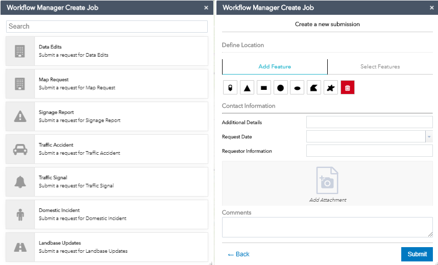

# ArcGIS Workflow Manager Create Job Widget

The ArcGIS Workflow Manager Create Job widget enables users to integrate [ArcGIS Workflow Manager Server](http://server.arcgis.com/en/workflow-manager) functionality within 
their own applications created in Web AppBuilder for ArcGIS. It is designed so users can configure 
and deploy the widget and create jobs in ArcGIS Workflow Manager easily and quickly. Source code is provided for 
developers who would like to customize the widget.

## Features
* Ready-to-deploy Workflow Manager widget for Web AppBuilder for ArcGIS.
  * [Web AppBuilder Portal Edition](http://server.arcgis.com/en/portal/latest/use/welcome.htm)
  * [Web AppBuilder Developer Edition](https://developers.arcgis.com/web-appbuilder/)
* Easily configurable to meet custom business needs and requirements - no programming skills required to deploy.
 
## Things we do not support currently:

* Extended Property types that are not supported include Geographic Dataset, Domain, and Multi-level Table List. These properties are hidden in the widget configuration page.
* IE11 cannot display job type icons in the widget.
* Cannot Define LOI with buffer.
* Job type's default properties cannot be configured in the widget. New jobs are created with default properties if they have been configured, such as assignment and dates. 
 
### Supported Browsers

The Workflow Manager Create Job widget supports the following browsers:
* Chrome
* Firefox
* Internet Explorer 11+
* Edge

## Instructions

1. Fork and then clone the repo. 
2. Deploy the widget to Web AppBuilder for ArcGIS following the 
[deployment and configuration instructions](README_CONFIG.md).

## Requirements

The Workflow Manager Create Job widget can be used in the following Web AppBuilder for ArcGIS environments:
* [Web AppBuilder Portal Edition](http://server.arcgis.com/en/portal/latest/use/welcome.htm)
* [Web AppBuilder Developer Edition](https://developers.arcgis.com/web-appbuilder/)

## Resources

* [ArcGIS Workflow Manager for Server](https://server.arcgis.com/en/workflow-manager)
* [ArcGIS Workflow Manager Discussion on GeoNet](https://geonet.esri.com/community/gis/solutions/workflow-manager)

## Issues

Find a bug or want to request a new feature?  Please let us know by submitting an issue.

## Contributing

Esri welcomes contributions from anyone and everyone. Please see our [guidelines for contributing](https://github.com/esri/contributing).

## Licensing
Copyright 2017 Esri

Licensed under the Apache License, Version 2.0 (the "License");
you may not use this file except in compliance with the License.
You may obtain a copy of the License at

   http://www.apache.org/licenses/LICENSE-2.0

Unless required by applicable law or agreed to in writing, software
distributed under the License is distributed on an "AS IS" BASIS,
WITHOUT WARRANTIES OR CONDITIONS OF ANY KIND, either express or implied.
See the License for the specific language governing permissions and
limitations under the License.

A copy of the license is available in the repository's [license.txt]( https://raw.github.com/Esri/quickstart-map-js/master/license.txt) file.
